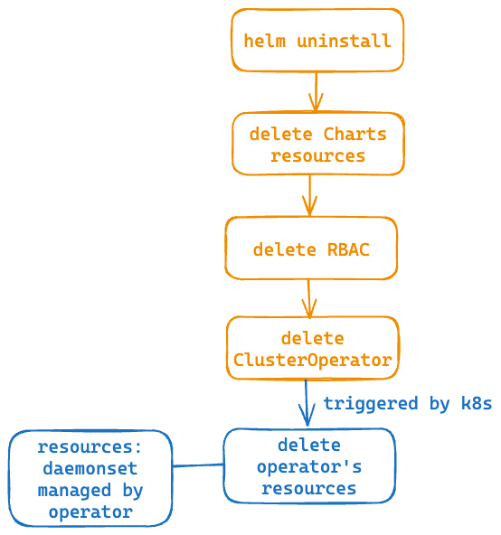

### 引言
在现代云原生生态系统中，Kubernetes 和 Helm 被广泛用于资源部署和管理。Helm，作为 Kubernetes 的包管理工具，简化了应用的部署和管理。然而，在使用 Operator 部署非 Helm 管理的 Kubernetes 资源时，如 DaemonSet，我们面临一个独特的挑战：如何在卸载时正确处理这些资源。

### 问题深入
通常，Helm Chart 定义了资源的卸载顺序。但当涉及到 Operator 直接管理的资源时，例如 DaemonSet，这些资源并不在 Helm Chart 的控制之下。因此，在执行 Helm 卸载操作时，可能会导致相关 RBAC 资源先于 DaemonSet 的 Pods 被删除，进而导致 Pods 中的 pre-stop 钩子执行失败，留下未清理的资源。

### 解决方案介绍
为了应对这一挑战，我们可以利用 Kubernetes 的 `finalizers` 和 Helm 的 pre-delete 钩子。Finalizers 允许在删除 Kubernetes 对象之前执行清理逻辑，而 pre-delete 钩子则允许我们在 Helm 删除资源之前进行干预。

### 实现细节
1. **Finalizers 的应用**：我们在 Custom Resource (CR) 中添加 `finalizers` 字段，这确保在完全删除资源之前，可以执行必要的清理步骤。

2. **Pre-delete 钩子的使用**：通过添加一个 Job 作为 pre-delete 钩子，该 Job 触发 `kubectl delete clusteroperator` 命令，在 Helm 卸载流程中先行执行。

3. **Operator 的逻辑调整**：修改 Operator 的 reconcile 逻辑，以确保在处理 delete 事件时，按顺序先卸载 DaemonSet，再卸载其他相关资源。

4. **Helm 卸载命令优化**：在执行 Helm 卸载命令时，添加 `--wait` 参数，确保所有资源都被正确清理后再完成卸载。

### 优势和影响
这种方法提供了对资源卸载顺序的更精细控制，确保在删除过程中执行必要的清理和资源释放操作。通过这种方式，我们可以有效地避免因依赖资源提前删除导致的清理失败。

### 流程图解析

- **图一** 展示了不使用 finalizers 和 pre-delete hook 的标准 Helm 卸载流程。

- **图二** 展示了引入 finalizers 和 pre-delete hook 后的优化流程。

### 结论
在 Kubernetes 和 Helm 的环境中，正确处理非 Helm 管理资源的卸载非常关键。通过结合 Kubernetes 的 finalizers 和 Helm 的 pre-delete 钩子，我们不仅解决了资源依赖问题，也提升了整体的资源管理效率和安全性。

### 附录
- [Finalizers | Kubernetes](https://kubernetes.io/zh-cn/docs/concepts/overview/working-with-objects/finalizers/)
- [Helm | Chart Hook](https://helm.sh/zh/docs/topics/charts_hooks/)